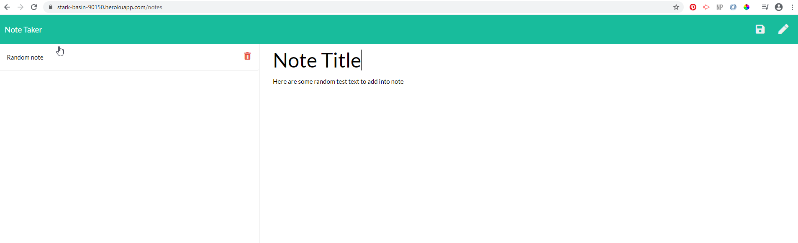

# Note Taker with Express & NodeJS

This project looks at using Express to set up a server for a note taker web application hosted on Heroku. The application allows the user to type up notes with a title and contents as well as being able to delete individual notes selected. It makes use of GET, POST, and DELETE to allow the server script file to communicate between the front end note page with the database set up.

Link to the Notes Taker app: 

## Usage

Run the application by entering the site, and clicking 'Get Started'. When directed to the notes page, the note input area will be on the right side where you need to enter a title with the text before being able to save the note. Once a title and text is entered, the save button will pop up on the top right of the page where there will also be a clear note button to clear the current unsaved note. Once the note is saved the user will be able to delete individual notes by clicking the bin icon next to the note title.

## Examples

Homepage:

Notes page:

